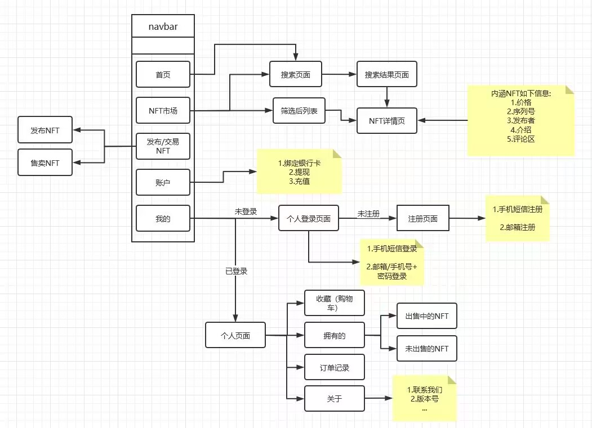

# software-project

## NABCD模型分析

1. N(Need 需求)你的创意解决了用户的什么需求?

- &emsp;NFT，全称为Non-Fungible Token，指非同质化通证，实质是区块链网络里具有唯一性特点的可信数字权益凭证，是一种可在区块链上记录和处理多维、复杂属性的数据对象。创作者可以通过NFT来售卖自己的作品，同时也可以很有效的避免盗版的产生，维护创作者的权益。同时，我们创建了一个UGC社区，大家可以在其中进行交易、交流。

2. A(Approach 做法)你有什么招数来解决用户的痛苦或问题？

- &emsp;通过简洁明了的操作界面，丰富的商品种类，让元宇宙等宏大抽象的概念展现在人们面前，让人们更靠近商品层次，设计从生产到交易，从购入到售出的系统化的创作与交易平台。让人们以更传统的方式来接受新兴事物。

3. B(Benefit 好处)你这个产品或服务会给用户带来什么好处？

- &emsp;其一，随着数字化发展迅猛，数字化虚拟产品越来越多，物质生活越来越富足，人们更加注重精神层面的需求。虚拟世界中的虚拟身份、游戏装备、皮肤等数字化资产迅速成为了人们精神需求中的顶流需求之一，但目前这些数字资产都有一个致命的缺陷，那就是中心化，机构平台几乎掌控了所有的控制权。想要将数字资产变成真正的私有资产，那就必须实现去中心化。NFT就是一个最好的解决方案，NFT是区块链上的有价编码，可以永久保存用户对数字资产的所有权。
- &emsp;其二，NFT具备的唯一性保证人们在区块链社区中拥有一个不可替代的身份。

4. C(Competitors 竞争)你的产品有没有类似的竞争者，他们的产品怎么样？

- &emsp; 在国外有着许多类似的项目，但是在国内，由于比特币等虚拟货币的不流通，大部分NFT产品均由官方来制作以及拍卖交易，而大部分用户只能通过网站或软件制作出自己的NFT而不能进行交易和流通，而我们的软件作为一个去中心化的平台，采用UGC的策略，建立一个交易社区，在当今国内市场上还是较为少见的。

5. D(Delivery 推广)你如何推销你的产品？

- &emsp; 通过在特定网站投放广告以及相应用户群体在社区中的转发分享来传播。

## 团队成员及分工

成员|负责模块|团队贡献度
:-:|:-:|:-:
邱攀攀|后端接口开发|25%
杨少生|后端开发|25%
方一舟|美工设计，作图|25%
钟 晟|前端主体框架开发|25%

### UML图

